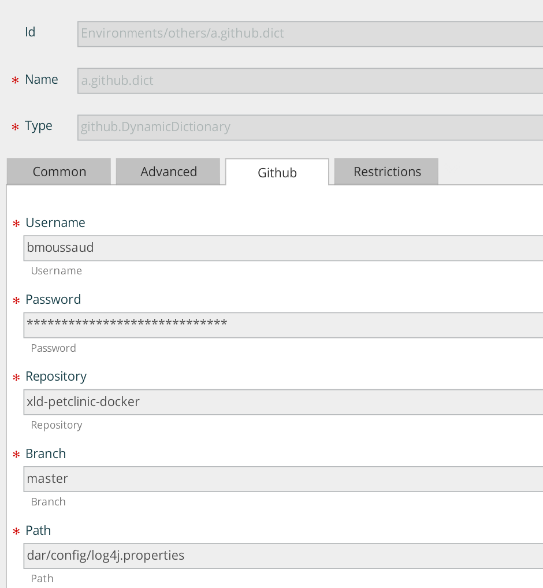

# Overview #

The [GitHub](http://www.github.com) Dynamic Dictionary is a XL Deploy plugin that adds capability to define dictionary whose the content is a property file stored and managed on [GitHub](http://www.github.com).
 

# CI status #

[![Build Status][xld-github-dynamic-dictionaries-plugin-travis-image] ][xld-github-dynamic-dictionaries-plugin-travis-url]
[![Codacy Status][xld-github-dynamic-dictionaries-plugin-codacy-image] ][xld-github-dynamic-dictionaries-plugin-codacy-url]
[![Code Climate Status][xld-github-dynamic-dictionaries-plugin-code-climate-image] ][xld-github-dynamic-dictionaries-plugin-code-climate-url]
[![License: MIT][xld-github-dynamic-dictionaries-plugin-license-image] ][xld-github-dynamic-dictionaries-plugin-license-url]

[xld-github-dynamic-dictionaries-plugin-travis-image]: https://travis-ci.org/xebialabs-community/xld-github-dynamic-dictionaries-plugin.svg?branch=master
[xld-github-dynamic-dictionaries-plugin-travis-url]: https://travis-ci.org/xebialabs-community/xld-github-dynamic-dictionaries-plugin
[xld-github-dynamic-dictionaries-plugin-codacy-image]: https://api.codacy.com/project/badge/Grade/7f6246c1eb9b4177abf501844472d798
[xld-github-dynamic-dictionaries-plugin-codacy-url]: https://www.codacy.com/app/joris-dewinne/xld-github-dynamic-dictionaries-plugin
[xld-github-dynamic-dictionaries-plugin-code-climate-image]: https://codeclimate.com/github/xebialabs-community/xld-github-dynamic-dictionaries-plugin/badges/gpa.svg
[xld-github-dynamic-dictionaries-plugin-code-climate-url]: https://codeclimate.com/github/xebialabs-community/xld-github-dynamic-dictionaries-plugin
[xld-github-dynamic-dictionaries-plugin-license-image]: https://img.shields.io/badge/License-MIT-yellow.svg
[xld-github-dynamic-dictionaries-plugin-license-url]: https://opensource.org/licenses/MIT

# Installation #

Place the plugin JAR file into your `SERVER_HOME/plugins` directory.

# Example #

Below a screenshot that defines the parameters of the `github.DynamicDictionary`

